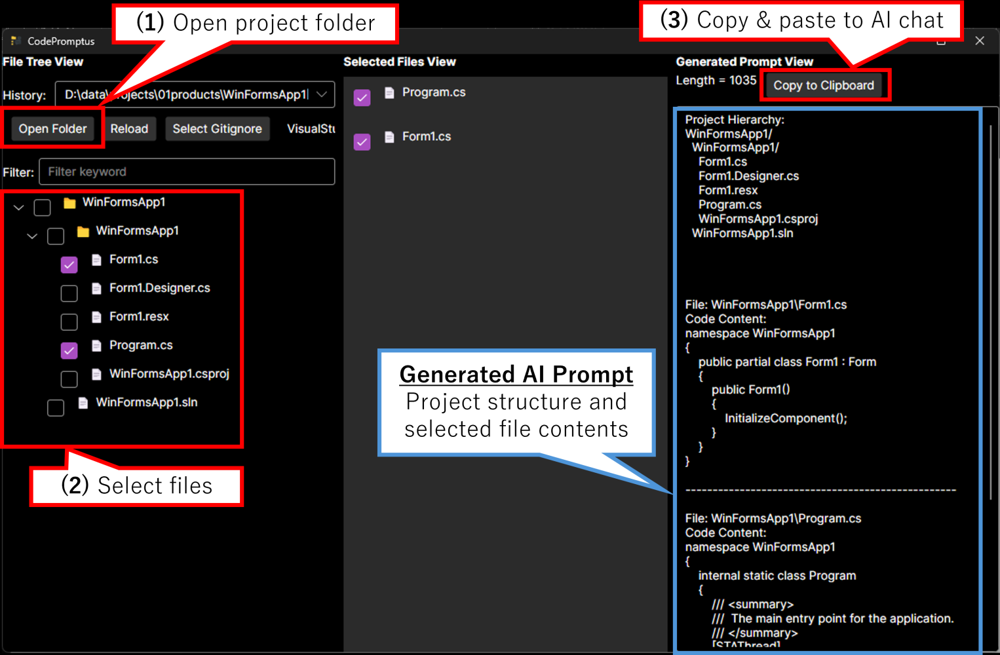

# CodePromptus
**言語:** [🇺🇸 English](README.md) | [🇯🇵 日本語](README.ja.md)

**👉 [バイナリダウンロードはこちら！](https://github.com/prota-p/CodePromptus/releases/)**

プロジェクトフォルダからファイルを選択し、AIプロンプトを自動生成するデスクトップアプリケーションです。

## 概要
開発者がAIにコーディングについて効率的に相談できるよう、プロジェクトの構造とコード内容を含むプロンプトを簡単に作成できるツールです。

## 背景
AIにコーディングの質問をする際の手動コピー&ペースト作業を自動化し、開発者とAIの対話を効率化するために開発しました。

## 主な機能

- プロジェクトフォルダの階層構造を表示
- ファイルの選択とフィルタリング
- .gitignoreテンプレートによる不要ファイルの自動除外
- 選択したファイルからAIプロンプトを自動生成
- 生成されたプロンプトのワンクリックコピー

## スクリーンショット



## 動作環境

- Windows 11 (動作確認済み)
- MacOS、Linux向けバイナリも公開していますが、動作確認はしていません。
- .NET 9.0
  - アプリのバイナリは自己完結形式のため、.NET 9.0を別途インストールする必要はありません。

## 使い方

1. **「Open Folder」** でプロジェクトフォルダを選択
2. 適切な **.gitignoreテンプレート** を選択（自動でプリセットテンプレートが設定されます）
3. 左のツリーで **ファイルを選択**
4. 右側に生成された **プロンプトをコピー**
5. お好みのAIサービス（例：ChatGPT）に貼り付けて使用

## 開発
### ビルドとデバッグ実行

```bash
git clone https://github.com/prota-p/CodePromptus.git
cd CodePromptus
dotnet build
dotnet run --project App/CodePromptus.App.csproj
```

### テスト実行

`Tests`フォルダ配下に、サービステスト・E2Eテストなどの自動テストを用意しています。
**※現時点ではもっとも基本的なシナリオのみです**

テストの実行方法：

```bash
dotnet test
```

### サードパーティライセンスファイルの生成
```bash
dotnet tool install --global nuget-license
nuget-license --input App/CodePromptus.App.csproj --output JsonPretty --file-output Tools/ThirdPartyLicenses/Auto.json
nuget-license --input App/CodePromptus.App.csproj --license-information-download-location Tools/ThirdPartyLicenses/Auto
dotnet run --project Tools/ThirdPartyLicenseGenerator .\Tools\ThirdPartyLicenses
```

### バイナリ作成

```bash
dotnet publish App/CodePromptus.App.csproj -c Release -r [RID] --self-contained=true -p:PublishSingleFile=true -o publish-[RID]
```
[RID] はターゲットOSにあわせて win-x64、osx-x64、linux-x64 などに置き換えてください。

## 技術スタック

- Avalonia UI (.NET クロスプラットフォーム UI)
- ReactiveUI (MVVM)
- Fluid (テンプレートエンジン)

## ライセンス

MIT License

## コントリビューション

Issues や Pull Request をお気軽にお送りください。

このリポジトリに貢献（コード、ドキュメント、その他のコンテンツの提供）を行うことにより、あなたの貢献がMITライセンスの下でライセンスされることに同意したものとみなされます。