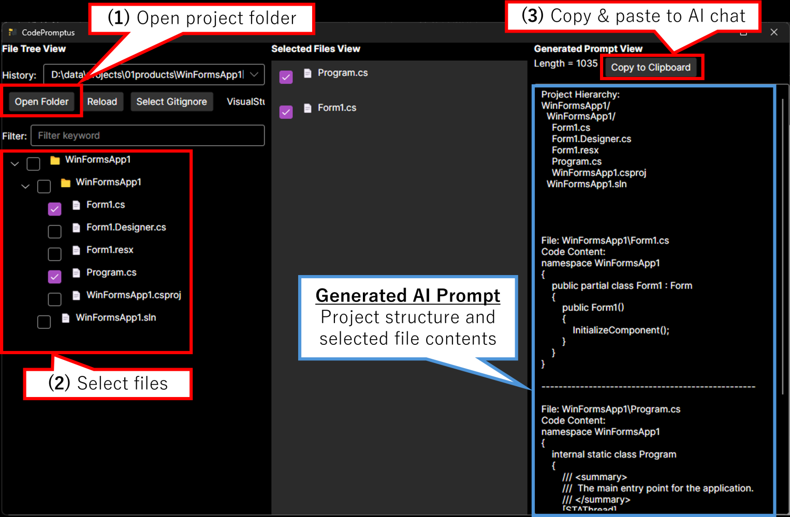

# CodePromptus
**Language:** [🇺🇸 English](README.md) | [🇯🇵 日本語](README.ja.md)

**👉 [Download the latest release here!](https://github.com/prota-p/CodePromptus/releases/)**

A desktop application that selects files from project folders and automatically generates AI prompts.

## Overview
A tool that enables developers to easily create prompts containing project structure and code content for efficient AI consultation about coding.

## Background
Developed to automate the manual copy-and-paste work when asking AI coding questions, streamlining the dialogue between developers and AI.

## Key Features
- Display project folder hierarchy structure
- File selection and filtering
- Automatic exclusion of unnecessary files using .gitignore templates
- Automatic AI prompt generation from selected files
- One-click copy of generated prompts

## Screenshots


## System Requirements
- Windows 11 (tested and confirmed)
- MacOS and Linux binaries are also available, but not tested.
- .NET 9.0
  - No separate installation of .NET 9.0 is required as the app binary is self-contained.

## Usage
1. Select a project folder with **"Open Folder"**
2. Choose an appropriate **.gitignore template** (preset templates are automatically configured)
3. **Select files** in the left tree
4. **Copy the generated prompt** on the right side
5. Paste into your preferred AI service (e.g., ChatGPT) and use

## Development

### Build and Debug Run
```bash
git clone https://github.com/prota-p/CodePromptus.git
cd CodePromptus
dotnet build
dotnet run --project App/CodePromptus.App.csproj
```

### Test Execution
Automated tests (unit, service, end-to-end) are provided in the `Tests` folder.  
**Note:** Current test coverage is basic and focuses on core scenarios. 

To run the tests:
```bash
dotnet test
```

### Generate Third-Party License Files
```bash
dotnet tool install --global nuget-license
nuget-license --input App/CodePromptus.App.csproj --output JsonPretty --file-output Tools/ThirdPartyLicenses/Auto.json
nuget-license --input App/CodePromptus.App.csproj --license-information-download-location Tools/ThirdPartyLicenses/Auto
dotnet run --project Tools/ThirdPartyLicenseGenerator .\Tools\ThirdPartyLicenses
```

### Binary Creation
```bash
dotnet publish App/CodePromptus.App.csproj -c Release -r [RID] --self-contained=true -p:PublishSingleFile=true -o publish-[RID]
```
Replace [RID] with the target OS such as win-x64, osx-x64, linux-x64, etc.

## Tech Stack
- Avalonia UI (.NET cross-platform UI)
- ReactiveUI (MVVM)
- Fluid (template engine)

## License
MIT License

## Contributing
Feel free to send Issues or Pull Requests.
By contributing to this repository (providing code, documentation, or other content), you agree that your contributions will be licensed under the MIT License.